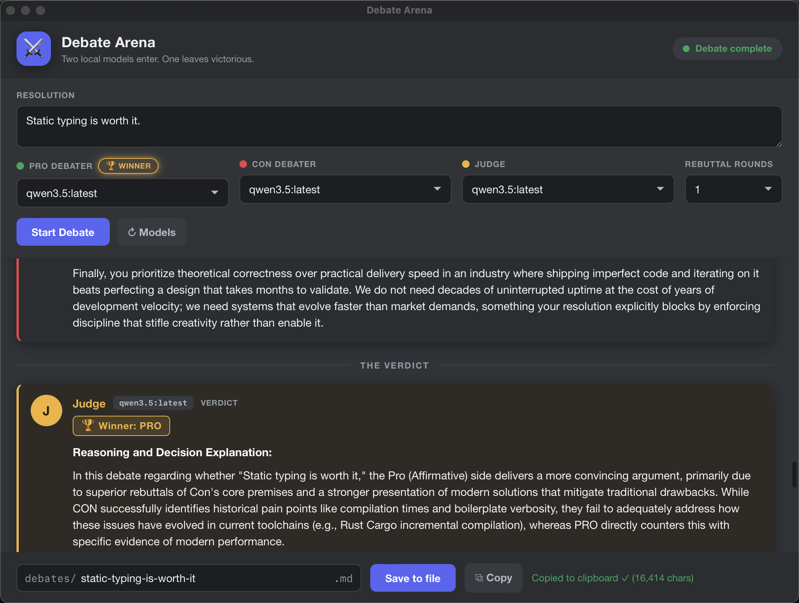

# Debate Arena

Pit two local [Ollama](https://ollama.com) language models against each other in
a structured, judged debate — right from a native desktop window driven by the
[GitHub Copilot CLI](https://github.com/github/copilot-cli).

Pick a model for each debater and a third to judge, give them a resolution, and
watch the match stream in live through opening statements, rebuttals, and
closing arguments. The judge then declares a winner and explains the verdict.



## Features

- **Two debaters + a judge**, each a model you choose from your installed Ollama models.
- **Live streaming** of every turn, token by token, in a clean Discord-inspired dark UI.
- **Structured format**: opening statements → configurable rebuttal rounds → closing statements → verdict.
- **A real verdict**: the judge picks a winner (or a draw) and explains why.
- **Save** the full debate to Markdown with a YAML front-matter metadata block, or **Copy** it to the clipboard.
- **Cancel** an in-progress debate at any time.
- Runs against your **local** Ollama by default, so debates stay on your machine
  (unless you point `OLLAMA_HOST` at a remote server).

## Requirements

- [GitHub Copilot CLI](https://github.com/github/copilot-cli).
- [Ollama](https://ollama.com) running locally with at least one model pulled
  (e.g. `ollama pull llama3.2` — any installed model works).

## Getting started

1. Clone this repository and start the Copilot CLI from inside it:
   ```bash
   git clone https://github.com/<your-org>/debate-arena.git
   cd debate-arena
   copilot
   ```
   Copilot CLI discovers the project extension under
   [`.github/extensions/debates/`](.github/extensions/debates/) automatically and
   installs its dependencies on first load.
2. Make sure Ollama is running and has at least one model (`ollama list`).
3. Run the slash command **`/debates`** to open the Debate Arena window.
4. Enter a resolution, choose your Pro / Con / Judge models and the number of
   rebuttal rounds, then click **Start Debate**.

Saved debates are written to a `debates/` directory in the current working
directory (git-ignored by default).

## How it works

The app is a Copilot CLI extension built on the `copilot-webview` library. A
native window (served from the extension's `content/` directory) talks to the
extension over a WebSocket bridge: the page calls into the extension to list
models, run and cancel debates, and save or copy results, while the extension
streams Ollama `/api/chat` output back into the page.

See [`.github/extensions/debates/README.md`](.github/extensions/debates/README.md)
for extension internals, the saved-file format, and development notes.

## License

Released under [Creative Commons CC0 1.0 Universal](LICENSE) — a public-domain
dedication. You can copy, modify, and distribute this work, even for commercial
purposes, without asking permission.
