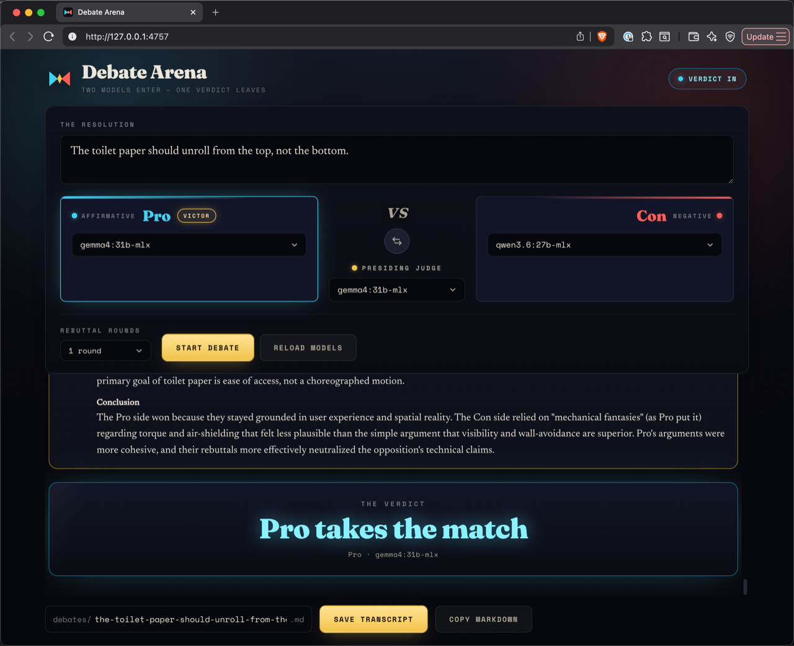
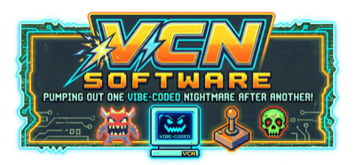

# Debate Arena

Pit two local LLMs via [Ollama](https://ollama.com) against each other in a
structured, judged debate.

Pick a model for each debater and a third to judge, give them a resolution, and
watch the match stream in live through opening statements, rebuttals, and
closing arguments. The judge then declares a winner and explains the verdict.

It comes in two flavors that share the same debate engine and saved-file format:

- A **standalone local app** ([`standalone/`](standalone/)) — a dependency-free
  Node server you open in your browser. Just `node server.mjs`.
- A **GitHub Copilot CLI extension** ([`.github/extensions/debates/`](.github/extensions/debates/))
  — a native desktop window driven by the
  [GitHub Copilot CLI](https://github.com/github/copilot-cli).



## Features

- **Two debaters + a judge**, each a model you choose from your installed Ollama models.
- **Live streaming** of every turn, token by token, with the Pro and Con corners facing off across the stage.
- **Structured format**: opening statements → configurable rebuttal rounds → closing statements → verdict.
- **A real verdict**: the judge picks a winner (or a draw) and explains why.
- **Save** the full debate to Markdown with a YAML front-matter metadata block, or **Copy** it to the clipboard.
- **Cancel** an in-progress debate at any time.
- Runs against your **local** Ollama by default, so debates stay on your machine
  (unless you point `OLLAMA_HOST` at a remote server).

## Requirements

- [Ollama](https://ollama.com) running locally with at least one model pulled
  (e.g. `ollama pull llama3.2` — any installed model works).
- For the standalone app: [Node.js](https://nodejs.org) 18+ (no `npm install` needed).
- For the extension: the [GitHub Copilot CLI](https://github.com/github/copilot-cli).

## Getting started

First clone the repository and make sure Ollama is running with at least one
model pulled (`ollama list`):

```bash
git clone https://github.com/mmacy/debate-arena.git
cd debate-arena
```

### Standalone app

```bash
cd standalone
node server.mjs
```

The server prints its URL (default <http://127.0.0.1:4757>) and opens your
browser. Enter a resolution, choose your Pro / Con / Judge models and the number
of rebuttal rounds, then click **Start debate**. See
[`standalone/README.md`](standalone/README.md) for configuration options.

### Copilot CLI extension

Start the Copilot CLI from the repository root:

```bash
copilot
```

Copilot CLI discovers the project extension under
[`.github/extensions/debates/`](.github/extensions/debates/) automatically and
installs its dependencies on first load. Run the slash command **`/debates`** to
open the Debate Arena window, then set up the match the same way.


Either way, saved debates are written to a `debates/` directory in the directory
you launched from (git-ignored by default).

## How it works

Both flavors run the same debate orchestration — list models, stream each turn
from Ollama's `/api/chat`, parse the judge's verdict, render Markdown — and only
differ in how the UI and the engine talk to each other:

- The **standalone app** is a zero-dependency Node server. The browser UI calls
  the engine over `POST /api/rpc` and receives streamed turns over a
  Server-Sent Events channel (`GET /api/events`).
- The **extension** is built on the `copilot-webview` library. A native window
  talks to the extension over a WebSocket bridge.

In both cases the page calls in to list models, run and cancel debates, and save
or copy results, while the engine streams Ollama output back token by token.

See [`standalone/README.md`](standalone/README.md) and
[`.github/extensions/debates/README.md`](.github/extensions/debates/README.md)
for internals, the saved-file format, and development notes.

## License

Released under [Creative Commons CC0 1.0 Universal](LICENSE) — a public-domain
dedication. You can copy, modify, and distribute this work, even for commercial
purposes, without asking permission.

---

<p align="center">
  
</p>
